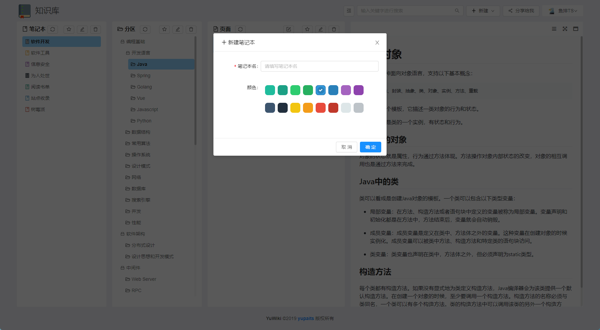

# YuWiki

个人知识库管理应用

## 使用方式

下载[软件包](https://github.com/yupaits/yuwiki/releases/download/v1.0.0/yuwiki.windows.zip)并解压，运行解压后的`yuwiki.exe`启动程序。

在浏览器输入[http://localhost:8888](http://localhost:8888)进入登录页面，注册账号并登录之后可进入程序主界面。

## 界面展示

- 主界面

- 折叠分区

- 新建笔记本

- 文档编辑

- 文档搜索

- 共享笔记本

## 待办清单

- 分区树跨层级拖拽排序